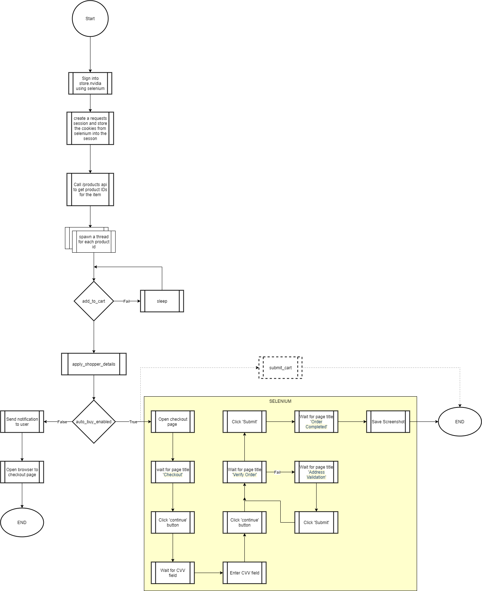

# README.md

Tool to help us buy a GPU in 2020

[Installation](#Installation) | [Usage](#Usage) | [Discord](https://discord.gg/hQeUbRv)  | [Troubleshooting](#Troubleshooting)
## Installation

This project uses [Pipenv](https://pypi.org/project/pipenv/) to manage dependencies. Hop in my [Discord](https://discord.gg/hQeUbRv) if you have ideas, need help or just want to tell me about how you got your new 3080. [TerryFrench](https://github.com/TerryFrench) has also created a youtube video detailing how to get this project running on Windows 10 as well. Huge thanks to him. 

[](https://www.youtube.com/watch?v=TvOQubunx6o)


```
pip install pipenv
pipenv shell 
pipenv install
```

Run it
```
python app.py

Usage: app.py [OPTIONS] COMMAND [ARGS]...

Options:
  --help  Show this message and exit.

Commands:
  amazon
  nvidia
```

## Usage

Ok now we have a basic GUI. GUIs aren't my strong suit, but pretty much the top box is the settings for amazon and
the bottom box is the settings for Nvidia. 

### Amazon 
- Open a chrome browser
- Log into Amazon
- Go to a product page
- Refresh the page until the 'Buy Now' option exists
- If the price is under the "Price Limit", it will buy the item.

Example usage:
```
python app.py amazon
Amazon Email []: hari@email.com
Amazon Password []: mypassword
Amazon Item URL []: https://www.amazon.com/dp/B08HHDP9DW
Maximum Price to Pay [1000]: 1000
...
INFO: "2020-09-19 00:07:02,199 - Logged in as hari@email.com
INFO: "2020-09-19 00:07:05,200 - Loading page: https://www.amazon.com/dp/B08HHDP9DW
INFO: "2020-09-19 00:07:06,452 - Loaded page for ASUS TUF Gaming NVIDIA GeForce RTX 3080 Graphics Card (PCIe 4.0, 10GB GDDR6X, HDMI 2.1, DisplayPort 1.4a, Dual Ball Fan Bearings, Military-Grade Certification, GPU Tweak II)
INFO: "2020-09-19 00:07:06,474 - Initial availability message is: Currently unavailable. We don't know when or if this item will be back in stock.
INFO: "2020-09-19 00:07:06,494 - Refreshing page.
INFO: "2020-09-19 00:07:07,695 - Current availability message is: Currently unavailable. We don't know when or if this item will be back in stock.
```

You can also save your amazon config to your environment variables. This will set them as the defaults in the CLI to save time entering them each time.

**MacOS and Linux Bash Shells**
```
export  amazon_email=user@email.com
export  amazon_password=supersecurepassword
export  amazon_item_url=https://www.amazon.com/dp/B08HHDP9DW?
export  amazon_price_limit=1000
```

**Linux csh/tcsh**
```
setenv  amazon_email user@email.com
setenv  amazon_password supersecurepassword
setenv  amazon_item_url https://www.amazon.com/dp/B08HHDP9DW?
setenv  amazon_price_limit 1000
```

**Windows**
```
set amazon_email=user@email.com
set amazon_password=supersecurepassword
set amazon_item_url=https://www.amazon.com/dp/B08HHDP9DW?
set amazon_price_limit=1000
```


### Nvidia 
- Call Digitalriver API to get product number for the GPU selected (2060S, 3080, 3090)
- Call Digitalriver API to check if the GPU is in stock until it is in stock
- Will open a window in your default browser with the GPU in your cart when it is stock.

Example usage:
```
python app.py nvidia
What GPU are you after?: 3080
What locale shall we use? [en_us]:
...
19092020 12:05:46 AM : Calling https://api.digitalriver.com/v1/shoppers/me/products/5438481700/inventory-status? : DEBUG -stores.nvidia
19092020 12:05:46 AM : Returned 200 : DEBUG -stores.nvidia
19092020 12:05:46 AM : Stock status is PRODUCT_INVENTORY_OUT_OF_STOCK : INFO -stores.nvidia

```

### Nvidia Auto-Checkout Guide
First be sure to have a [Nvidia store](https://www.nvidia.com/en-us/shop/) account with all of your infos (billing address etc ...) already filled in). 
Then make a copy of `autobuy_config.template_json` and name it `autobuy_config.json`. Be sure to remove all the single-line comments, which are denoted with `#`.
If this file exists and the credentials are valid, the bot will make a purchase for you.

```
{
  "NVIDIA_LOGIN": "fuckthesc@lpers.com",        # Your NVIDIA Store login
  "NVIDIA_PASSWORD": "12345",                   # Your NVIDIA Store password
  "FULL_AUTOBUY":false,                         # FALSE : Fill your infos but dont click on the last button / TRUE : Buy the card
  "CVV":"101",             # CCV code
  "BYPASS_ADDRESS_SUGGESTION":false             # Selects the address you entered not the one suggested
}
```




## Best Buy
This is fairly basic right now. Just login to the best buy website in your default browser and then run the command as follows:

```
app.py bestbuy --sku [SKU]
```

Example:
```
app.py bestbuy --sku 6429440
```

## EVGA
Make a copy of `evga_config.template_json` to `evga_config.json`:
```
{
  "username": "hari@",
  "password": "password!",
  "credit_card" : {
            "name": "Hari ",
            "number": "234234",
            "cvv": "123",
            "expiration_month": "12",
            "expiration_year": "2023"
        }
}
```

Test run command (Uses old gpu list and then stops before finishing the order)
`python app.py evga --test`

Autobuy command:
`python app.py evga`

### Notifications
This uses a notifications handler that will support multiple notification channels. 

#### Twilio
To enable Twilio notifications, first go to https://www.twilio.com/ and create a free account and get a Twilio number.
Then make a copy of `twilio_config.template_json` and name it `twilio_config.json`. If this file exists and the credentials are
valid, the notification handler will send you an sms when it carts or purchases an item.
```
{
  "account_sid": "ACCOUNT_SID",
  "auth_token": "AUTH_TOKEN",
  "from": "YOUR TWILIO NUMBER",
  "to": "THE NUMBER YOU WANT TO SEND SMS TO"
}
```

#### Discord
To enable Discord notifications, first get your wehbook url. Use the directions [here](https://support.discord.com/hc/en-us/articles/228383668-Intro-to-Webhooks) to get the webhook url.
Make a copy of the `discord_config.template_json` file and name it `discord_config.json` and place the webhook url here. 
```
{
  "webhook_url": "Discord webhook url here"
}
```

#### Telegram
To enable Telegram notifications, you have to create a new bot and get your chat id. Use the directions [here](https://medium.com/@ManHay_Hong/how-to-create-a-telegram-bot-and-send-messages-with-python-4cf314d9fa3e) (Creating your bot and Getting your Chat id sections).

Make a copy of the `telegram_config.template_json` file and name it `telegram_config.json` and place your `BOT_TOKEN` and `BOT_CHAT_ID` values here. 
```
{
    "BOT_TOKEN" : "1234567890:abcdefghijklmnopqrstuvwxyz",
    "BOT_CHAT_ID" : "111222333"
}
```

It is possible to notify multiple users at once. Just add a list as the `BOT_CHAT_ID` value:

```
{
    "BOT_TOKEN" : "1234567890:abcdefghijklmnopqrstuvwxyz",
    "BOT_CHAT_ID" : ["111222333", "444555666"]
}
```


## Troubleshooting

I suggest joining the #Support channel in [Discord](https://discord.gg/hQeUbRv) for personal assistance if these common fixes don't help.

**Error: ```selenium.common.exceptions.WebDriverException: Message: unknown error: cannot find Chrome binary```** 
The issue is that chrome is not installed in the expected location. See [Selenium Wiki](https://github.com/SeleniumHQ/selenium/wiki/ChromeDriver#requirements) and the section on [overriding the Chrome binary location .](https://sites.google.com/a/chromium.org/chromedriver/capabilities#TOC-Using-a-Chrome-executable-in-a-non-standard-location)

The easy fix for this is to add an option where selenium is used (amazon.py)
```
chrome_options.binary_location="C:\Users\%USERNAME%\AppData\Local\Google\Chrome\Application\chrome.exe"
```

**Error: ```selenium.common.exceptions.SessionNotCreatedException: Message: session not created: This version of ChromeDriver only supports Chrome version 85```**

You are not running the proper version of Chrome this requires. As of this update, the current version is Chrome 85. Check your version by going to ```chrome://version/``` in your browser. We are going to be targeting the current stable build of chrome. If you are behind, please update, if you are on a beta or canary branch, you'll have to build your own version of chromedriver-py.
